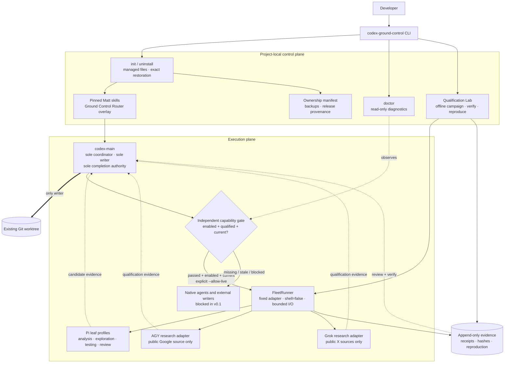

<h1 align="center">Ground Control for Codex</h1>

<p align="center">
  <a href="https://www.npmjs.com/package/codex-ground-control/v/0.1.0"></a>
  <a href="https://github.com/eisen0419/codex-ground-control/releases/latest"></a>
  
  
  <a href="LICENSE"></a>
</p>

<p align="center">
  <sub>English · <a href="https://github.com/eisen0419/codex-ground-control/blob/main/docs/readme/README.zh-CN.md">简体中文</a></sub>
</p>

<p align="center">
  <strong>A local-first, fail-closed workflow control plane for Codex.</strong><br />
  Install a reproducible engineering workflow, qualify every execution boundary,
  and keep one Codex coordinator in control.
</p>

<h3 align="center">
  <a href="https://github.com/eisen0419/codex-ground-control/releases/tag/v0.1.0"><ins>Get Ground Control v0.1.0</ins></a>
</h3>

<p align="center">
  <a href="#architecture">Architecture</a> ·
  <a href="#quick-start">Quick start</a> ·
  <a href="#cli">CLI</a> ·
  <a href="#optional-provider-lifecycle">Provider boundaries</a> ·
  <a href="https://github.com/eisen0419/codex-ground-control/releases/tag/v0.1.0">Release audit</a>
</p>

Ground Control is for individual macOS terminal users who already have
Codex CLI installed. The v0.1 package can initialize, diagnose, qualify, inspect
provider state, and uninstall itself from a Git worktree without provider
credentials, a second download, or network access.

Ground Control for Codex is an independent community project. It is not
affiliated with or endorsed by OpenAI or Matt Pocock.

## Why Ground Control?

<table>
<tr>
<td width="50%" valign="top">

### Reproducible by default

Ships pinned, unmodified Matt Pocock skills with a separate Ground Control
Router overlay and a verifiable release lock.

`init --dry-run` previews the exact managed surface before any write.

</td>
<td width="50%" valign="top">

### Fail closed, never open

Missing, stale, blocked, or mismatched capability evidence prevents execution
instead of silently relaxing the boundary.

Provider detection and credentials never imply authorization.

</td>
</tr>
<tr>
<td width="50%" valign="top">

### Evidence you can verify

Offline qualification produces immutable receipts, hashes, issue records, and
reproducible scenarios without model or provider-network calls.

`qualify verify` detects tampering and runtime drift.

</td>
<td width="50%" valign="top">

### Ownership you can reverse

Managed files carry before/after hashes and exact backup associations.
Uninstall restores only verified product-owned bytes.

Conflicts fail closed and remain available for human resolution.

</td>
</tr>
</table>

## Architecture

Ground Control separates installation, execution, and evidence. `codex-main`
is the only coordinator, workspace writer, and completion authority. Optional
providers are bounded leaf adapters: they can return candidate evidence, but
they cannot write the project, delegate again, change authorization, or declare
completion.



The gate is evaluated per adapter and per current runtime fingerprint. A pass
for one provider never qualifies another. The default release campaign is
offline; all live provider operations require the explicit `--allow-live`
flag. Native-agent and external-write gates remain blocked in v0.1.

## Quick start

Requirements:

- macOS
- Node.js 22 or newer
- Git
- Codex CLI

Run from an existing Git worktree. Preview the exact package version before
applying project-local changes:

```sh
npx --yes codex-ground-control@0.1.0 init --dry-run
npx --yes codex-ground-control@0.1.0 init
npx --yes codex-ground-control@0.1.0 doctor
npx --yes codex-ground-control@0.1.0 qualify
```

Ground Control deliberately pins `0.1.0` in release instructions instead of
using a mutable `latest` tag. Project-local installation is the default. It
changes only the current Git worktree plus product-owned qualification and
provider state under `~/.codex-ground-control/`; it does not install user-level
Codex instructions or skills unless the separate explicit global flow is
requested.

### Audited tarball

The npm package and GitHub Release attachment are byte-for-byte copies of the
audited v0.1.0 candidate:

- [npm package](https://www.npmjs.com/package/codex-ground-control/v/0.1.0)
- [GitHub Release](https://github.com/eisen0419/codex-ground-control/releases/tag/v0.1.0)
- SHA-256: `a480fa43563f03f62eec30ca6a62e02d7bf6f01183187da38e88d6e1d0da0c18`

Use a downloaded tarball without contacting npm:

```sh
npx --yes --offline \
  --package=./codex-ground-control-0.1.0.tgz \
  codex-ground-control init --dry-run
```

### v0.1.0 qualification

| Release gate | Audited result |
| --- | --- |
| v0.1.0 source | [`6b7e17e`](https://github.com/eisen0419/codex-ground-control/commit/6b7e17e48f6d273421e5b136d01478785803689a) |
| Test and static gates | 94/94 tests, typecheck, release-lock, and diff check passed |
| Offline core | 17/17 scenarios passed; evidence verified; network not used |
| Optional providers | Pi GLM, Pi DeepSeek, Pi MiniMax, AGY, and Grok ended disabled, unqualified, and blocked; live evidence remains partial |
| Failure isolation | Passed; optional-provider failures did not affect the qualified offline core |

See the
[v0.1.0 Release](https://github.com/eisen0419/codex-ground-control/releases/tag/v0.1.0)
for the complete audit and download verification.

## CLI

The examples below use the installed binary name. Run them from an existing Git
worktree, or prefix a command with
`npx --yes codex-ground-control@0.1.0`:

```sh
codex-ground-control init --dry-run
codex-ground-control init
codex-ground-control doctor
codex-ground-control qualify
codex-ground-control qualify verify <run-identity> <evidence-anchor>
codex-ground-control qualify reproduce <run-identity> <scenario-id>
codex-ground-control provider list
codex-ground-control provider enable pi-glm
codex-ground-control provider qualify pi-glm --allow-live
codex-ground-control provider run pi-glm analysis "Review this bounded input" --allow-live
codex-ground-control provider disable pi-glm
codex-ground-control uninstall
```

Add `--json` to a command to emit exactly one JSON receipt on stdout. Exit code
`0` means success, `2` means an operational blocker was detected, and `64`
means invalid command usage.

`init --dry-run` reports which managed files would be added, updated, or left
unchanged and performs no writes. A normal project-local installation:

- copies pinned, unmodified Matt Pocock skills into `.agents/skills/`;
- installs the Ground Control Router as a separate first-party overlay;
- appends one clearly marked managed block to `AGENTS.md`;
- records ownership, before/after SHA-256 hashes, release provenance, and the
  `AGENTS.md` backup association in `.codex-ground-control/manifest.json`.

Re-running `init` against the same release is idempotent. `doctor` is read-only:
it verifies macOS, Node.js, the Git boundary, Codex CLI, the installation
manifest, managed block, vendored skills and release lock. It also reports
ambient hooks, native Codex entry points, Pi/AGY/Grok public CLI versions, and
the independent `core`, provider, `native`, and `write` gates. Provider
detection or credential presence never means enabled, authorized, or qualified.
Optional provider absence does not fail `core`.

Each doctor finding has a stable ID, severity, state, scope, observed summary,
and next action. Human output groups core, provider, and fail-closed boundary
findings; `--json` emits the same decision as one versioned object. Doctor does
not repair configuration, install providers, inspect credential values, or run
live qualification.

`uninstall` removes only unchanged files owned by Ground Control and restores
the exact pre-install project instructions. Drift fails closed and is left
untouched for the user to resolve.

Project-local installation remains the default. Without `--global`, `init` and
`uninstall` do not modify `~/.codex`, `~/.agents/skills`, or other user-owned
configuration. `doctor` only reads the presence and shape of
`~/.codex/hooks.json` and the two native entry-point flags in
`~/.codex/config.toml`, without printing their contents. Qualification evidence
and project-scoped provider preferences are the explicit product-owned
exception under `~/.codex-ground-control/`; they do not alter Codex or provider
configuration.

### Explicit global installation

Use global scope only when the workflow should apply across projects:

```sh
codex-ground-control init --global --dry-run
codex-ground-control init --global
codex-ground-control doctor --global
codex-ground-control uninstall --global
```

In an interactive terminal, global `init` and `uninstall` print a path-level
diff and require `y` or `yes`. Automation and JSON mode must add the separate
`--confirm-global` flag:

```sh
codex-ground-control init --global --confirm-global --json
codex-ground-control uninstall --global --confirm-global --json
```

Global scope manages only the bounded targets `~/.codex/AGENTS.md`,
`~/.agents/skills/`, and product state under `~/.codex-ground-control/`.
It refuses filesystem roots, a project rooted at the entire home directory,
symlinked roots and symlinked managed paths. There is no force option.

Before user configuration changes, global init creates a private, verifiable
backup under `~/.codex-ground-control/backups/<backup-id>/`. Receipts contain
the opaque backup ID and logical `~/` paths, never the previous instruction
contents or absolute home path. An interrupted install leaves a transaction
that blocks further init until confirmed global uninstall safely recovers it.

Backups are retained while an installation or recoverable partial transaction
exists and are consumed after successful restoration. Audit evidence under
`~/.codex-ground-control/evidence/` has separate ownership and is preserved by
ordinary uninstall. A missing or modified backup, manifest, managed block, or
tool-owned asset produces a conflict before destructive cleanup.

The default `qualify` command runs the full packaged offline release campaign.
It makes no model or provider-network calls and writes every run to a new
directory under
`~/.codex-ground-control/evidence/qualification/<run-identity>/`. The JSON
receipt reports the campaign, terminal state, pass/fail counts, run identity,
runtime fingerprint, evidence-index path, and external SHA-256 anchor.

Each evidence index binds every run file by byte count and SHA-256.
`qualify verify` rejects an incorrect external anchor, missing or modified
evidence, unindexed files, strict-schema drift, and stale runtime/component
fingerprints. `qualify reproduce` reruns one scenario from an existing
campaign snapshot into a new run; it never upgrades that affected-only result
into a full release qualification. Expected fail-closed observations count as
passes, while expectation mismatches create stable issue records with evidence
and reproduction instructions.

The campaign, result, issue-ledger, and public-receipt schemas are shipped
under `schemas/qualification/`. Unknown fields and illegal states are rejected,
and a packaged audit fixture detects drift between receipt-schema decisions and
the public behavior validator. Qualification evidence records only allowlisted
runtime facts and component hashes, never credential or arbitrary environment
values.

### Optional provider lifecycle

Pi GLM (`zai-coding-cn/glm-5.2`), Pi DeepSeek
(`deepseek/deepseek-v4-pro`), Pi MiniMax (`minimax-cn/MiniMax-M3`), AGY, and
Grok are independent optional gates. `provider list` reports the same
detected, configured, enabled, qualified, drifted, disabled, blocked, and
execution-decision fields in JSON and human modes. Each Pi entry also reports
its exact public provider/model identity. AGY reports its `research-only`
role, Google surface, fixed `plan` mode, and
`gemini-3.6-flash-high` model. Grok reports its `research-only` role, X.com
surface, fixed `web-only` mode, and `grok-4.5` model. `configured` means only
that the profile's documented credential environment variable was observed;
read-only status commands do not read provider credential values or private CLI
credential stores.

All providers ship disabled and unqualified. `provider enable <id>` records a
project-scoped preference but cannot authorize execution without current
qualification evidence. `provider disable <id>` immediately blocks new
qualification or execution while preserving credentials and historical
evidence. Preferences are stored under
`~/.codex-ground-control/providers/<project-key>/` without the project path or
credential values.

Live qualification is never implicit:

```sh
codex-ground-control provider qualify <pi-glm|pi-deepseek|pi-minimax|agy|grok> --allow-live
```

Without `--allow-live`, the command fails before starting a provider process.
For Pi, qualification accepts only a unique JSON-mode assistant completion
whose runtime provider/model identity exactly matches the selected profile;
model prose or a zero exit code alone is insufficient.
For AGY, Ground Control requires CLI 1.1.7 or newer and starts a fixed
`gemini-3.6-flash-high` invocation with `--sandbox`, `--mode plan`, and a
bounded print timeout. Its cwd is a per-run isolated empty directory, while
provider API-key environment variables and unrelated secrets are withheld.
The adapter rejects any run-created workspace files before returning. Only a
fresh structured Google Search observation of the exact Python Software
Foundation website and identity can pass. Ground Control then independently
fetches that exact HTTPS URL, checks every redirect against the origin/path
allowlist, caps the response at 1 MB, and requires the public `Python` content
marker. Wrong or stale observations, trailing prose, and unverifiable sources
fail closed.
For Grok, Ground Control requires CLI 0.2.93 or newer. The adapter copies only
the cached Grok authentication file into a disposable per-run `GROK_HOME`,
switches the child process to a separate isolated `HOME`, and removes the
temporary runtime after success, failure, or timeout. User compatibility
imports, rules, agents, MCPs, hooks, memory, subagents, telemetry, feedback, and
auto-update are disabled before Grok starts. The fixed invocation exposes only
`web_search` and `web_fetch`, denies the Agent tool, uses strict sandboxing, and
never inherits API-key variables or unrelated secrets.

Grok qualification uses its native JSON Schema output and a strict adapter
envelope. It accepts only the exact official X account pairs
`https://x.com/xai` with `@xai`, or `https://x.com/SpaceXAI` with
`@spacexai`. Case variants, lookalikes, redirects, stale observations, unknown
envelopes, mixed prose, and workspace writes fail closed.
The command runs only the packaged `public-sources-v1` probe; there is no CLI
argument for a user prompt or private repository context. Provider receipts
bind the observed public CLI version, provider-specific FleetRunner adapter,
model or search contract, output schema, fixed probe, source rules, and shared
FleetRunner boundary. Evidence is append-only under
`~/.codex-ground-control/evidence/providers/`.

CLI or contract drift invalidates only providers that depend on that
fingerprint. A provider failure updates only its own gate: other current
providers and the default offline core qualification remain usable.
AGY and Grok receipts retain only the fixed public probe, verified public
source observation, CLI version, component fingerprints, and evidence hashes.
They label the output as qualification evidence, keep `codex-main` as
completion authority, and state that no workspace changes were applied. Grok
receipts also record the public research boundary and that temporary
authentication was neither retained nor recorded.

After a Pi profile has current qualification evidence, the main Codex may send
one bounded brief with an explicit live flag:

```sh
codex-ground-control provider run pi-deepseek review "Review only this supplied boundary." --allow-live
```

Supported activities are `analysis`, `exploration`, `testing`, and `review`.
Ground Control places the brief in the single fixed prompt argv slot. Pi runs
in an isolated empty directory with tools, sessions, extensions, skills,
prompt templates, context files, and approval prompts disabled, and inherits
only the selected profile's environment allowlist. Strict output is labelled
`candidate-evidence`; receipts state that `codex-main` remains completion
authority, review is required, and no workspace changes were applied.

The offline campaign also qualifies the deterministic FleetRunner boundary.
Jobs can select only a manifest adapter, allowed activity, bounded prompt and
timeout, and a named strict output contract. Command, argv, shell, tools,
environment, working directory, and recursive delegation are fixed outside the
job. FleetRunner launches with `shell=false`, passes only allowlisted
environment variables, and runs in either an isolated empty directory or a
controlled workspace copy under the run.

Every FleetRunner execution creates a new run containing normalized `job.json`,
public `metadata.json`, bounded raw `stdout.txt` and `stderr.txt`, and a final
`receipt.json`. A run succeeds only after a zero exit code and strict JSON
contract validation. The only normalization is one complete JSON fence;
trailing prose, multiple fences, malformed or internally invalid payloads,
timeouts, process failures, and stdout/stderr floods have stable fail-closed
states. Timeout handling terminates the complete process group. Qualification
continues to require native runtime entry points and all native workers to be
disabled, the native and write gates to be blocked, and the external writer
count to remain zero; those blocked gates do not prevent an independently
qualified core leaf fixture from passing.
The runtime fingerprint binds that allowlisted native-entry state, so changing
either switch makes earlier evidence `qualification-drifted`.

The architecture has one single Codex coordinator and only bounded external
leaf adapters. Provider gates are independent, the default release campaign is
offline, and every live provider operation requires explicit `--allow-live`.
The native and external write gates remain blocked in v0.1; no provider is
allowed to write the project or claim completion.

## Matt Pocock skills provenance

`release-lock.json` records the upstream repository, exact revision, install
mapping, file sizes, SHA-256 hashes, aggregate content hash, and MIT license
source. The npm tarball carries those exact bytes under
`vendor/mattpocock-skills/`, so initialization never downloads a mutable second
copy.

Ground Control does not patch the vendored files. Product-specific routing and
authority rules live under `assets/overlays/`. See
[`THIRD_PARTY_NOTICES.md`](THIRD_PARTY_NOTICES.md) for attribution and license
text.

## Development

```sh
npm run release-lock:verify
npm run typecheck
npm test
```

To smoke-test a locally packed artifact:

```sh
npm pack
npm install --prefix /tmp/codex-ground-control \
  ./codex-ground-control-0.1.0.tgz
/tmp/codex-ground-control/node_modules/.bin/codex-ground-control --help
```

The acceptance suite packs and installs the real npm tarball into a temporary
home, creates a fresh Git repository, denies network calls in the CLI process,
and verifies dry-run, empty and existing project instructions, idempotent
initialization, explicit global confirmation, private backups, interrupted
install recovery, symlink fault injection, doctor integrity checks, drift
refusal, runtime incompatibility, provider isolation, secret non-disclosure,
evidence retention, and exact restoration through the public executable.

## Scope

Ground Control v0.1 is intentionally narrow: individual macOS terminal users,
one Codex coordinator, project-local installation by default, and independently
gated leaf adapters. It does not promise a GUI, team authorization,
Windows/Linux support, general-purpose agent orchestration, provider write
access, or autonomous completion by an external model.

## License

MIT
