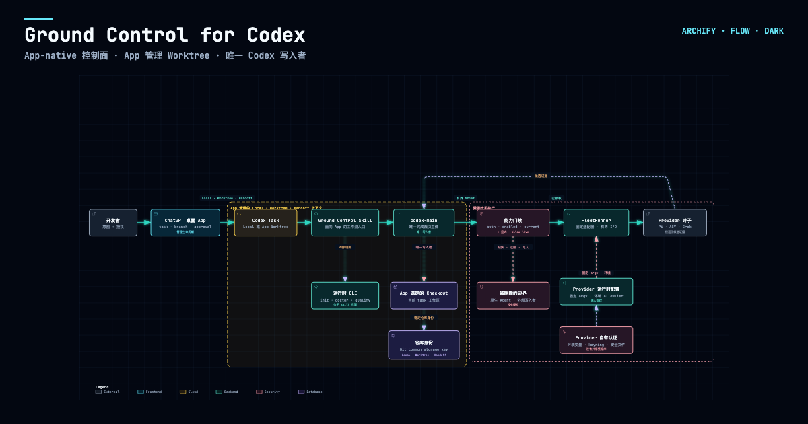

<h1 align="center">Ground Control for Codex</h1>

<p align="center">
  <a href="https://www.npmjs.com/package/codex-ground-control/v/0.1.0"></a>
  <a href="https://github.com/eisen0419/codex-ground-control/releases/latest"></a>
  
  
  
  <a href="../../LICENSE"></a>
</p>

<p align="center">
  <sub><a href="../../README.md">English</a> · 简体中文</sub>
</p>

<p align="center">
  <strong>面向 Codex 的 App-native、本地优先、失败时保持关闭的工作流控制面。</strong><br />
  在 Local 或 App 管理的 Worktree 中工作，为每条执行边界建立独立资格门禁，
  并始终由唯一 Codex 完成裁决主体掌握最终控制权。
</p>

<h3 align="center">
  <a href="#快速开始"><ins>试用 App-native v0.2 开发版</ins></a>
  ·
  <a href="https://github.com/eisen0419/codex-ground-control/releases/tag/v0.1.0">获取最新正式版 v0.1.0</a>
</h3>

<p align="center">
  <a href="#架构">架构</a> ·
  <a href="#快速开始">快速开始</a> ·
  <a href="#运行时-cli">运行时 CLI</a> ·
  <a href="#可选-provider-生命周期">Provider 边界</a> ·
  <a href="https://github.com/eisen0419/codex-ground-control/releases/tag/v0.1.0">发布审计</a>
</p>

Ground Control v0.2 面向在 macOS ChatGPT 桌面 App 中使用 Codex 开发软件
的个人用户。App 负责 chat、task、Local checkout、Worktree、Handoff、
branch 和 approval 的完整生命周期。Ground Control 是当前 App task 内由
skill 驱动的工作流层：核心门禁不依赖单独安装的 Codex CLI，也绝不会自行
创建、删除或 handoff App Worktree。

`codex-ground-control` 可执行文件仍然负责确定性的 bootstrap、诊断、资格验证
和有界 Provider 操作，但它位于 Ground Control skill 后面，只是内部执行层，
不是产品 UI，更不是第二套 task/worktree 编排器。

Ground Control for Codex 是独立的社区项目，与 OpenAI 或 Matt Pocock
不存在隶属、背书或官方合作关系。

## 为什么需要 Ground Control？

<table>
<tr>
<td width="50%" valign="top">

### 原生融入 Codex App

从 Local 或 App 管理的 Worktree task 开始。Ground Control 会安装面向
App 的 skill，并且只在 App 交给当前 task 的 checkout 中工作。

只要共享同一 Git common storage，Local、Worktree 和 Handoff 就共享同一
仓库身份；独立 clone 仍然彼此隔离。

</td>
<td width="50%" valign="top">

### 失败时保持关闭

资格证据缺失、过期、被阻断或不匹配时，系统拒绝执行，而非静默放宽边界。

检测到 Provider 或凭据，绝不等于已获授权或通过资格验证。

</td>
</tr>
<tr>
<td width="50%" valign="top">

### 证据可以复核

离线资格验证会生成不可覆盖的回执（receipt）、哈希、问题记录和可复现场景，
整个过程不调用模型，也不访问 Provider 网络。

`qualify verify` 可以检测证据篡改和运行时漂移。

</td>
<td width="50%" valign="top">

### 所有权可以撤销

每个托管文件都记录写入前后的哈希和精确备份关联。卸载仅恢复经过验证、
确属产品所有的字节。

发生冲突时继续保持关闭，并保留现场交由用户处理。

</td>
</tr>
</table>

## 架构

Ground Control 将安装、执行和证据三个平面分离。当前 App task 内的
`codex-main` 是唯一工作区写入者和完成裁决主体。可选 Provider 只是受限的
叶子适配器：它们可以返回候选证据，但不能修改项目、递归委派、改变授权或
宣布任务完成。task 和 Worktree 的生命周期由 App 管理，而不是 Ground
Control。

<p align="center">
  <a href="../architecture/ground-control.zh-CN.html">
    
  </a>
</p>

<p align="center">
  <sub>
    由 <a href="https://github.com/tt-a1i/archify">Archify</a> 生成并验证 ·
    <a href="../architecture/ground-control.zh-CN.html">交互式 HTML</a> ·
    <a href="../architecture/ground-control.zh-CN.architecture.json">typed JSON 源文件</a>
  </sub>
</p>

门禁按适配器和当前运行时指纹分别计算。某个 Provider 通过，不会让其他
Provider 自动获得资格。默认发布资格验证活动（campaign）完全离线；所有
实时 Provider 操作都必须显式传入 `--allow-live`。v0.2 中，原生 Agent
门禁和外部写入门禁始终保持 blocked。

## 快速开始

环境要求：

- macOS
- 带 Codex 的 ChatGPT 桌面 App
- Node.js 22 或更高版本
- Git

不需要单独安装 Codex CLI。

1. 在 ChatGPT 桌面 App 中打开目标 Git 仓库。
2. 在 **Local** 或由 App 创建的 **Worktree** 中启动 Codex task。
3. 当前 `main` 尚未发布，请先在本仓库构建精确的 v0.2 开发版 tarball：

   ```sh
   npm pack --pack-destination /tmp/codex-ground-control-v0.2
   ```

4. 在目标 App task 中，让 Codex 预览并安装这个 tarball：

   ```sh
   npx --yes \
     --package=/tmp/codex-ground-control-v0.2/codex-ground-control-0.2.0.tgz \
     codex-ground-control init --dry-run
   npx --yes \
     --package=/tmp/codex-ground-control-v0.2/codex-ground-control-0.2.0.tgz \
     codex-ground-control init
   ```

5. 如果当前 task 没有刷新刚安装的 skill，请新建一个 Codex task，然后调用
   **Ground Control**。skill 会在背后调用运行时，执行 `doctor`、离线资格
   验证和 Provider 门禁。

项目本地安装是默认方式：它只修改 App 当前选中的 checkout，以及
`~/.codex-ground-control/` 下由产品拥有的证据和仓库级 Provider 状态。
它不创建或管理 Worktree。全局安装仍是单独预览、单独显式确认的流程。

> **发布状态：** `0.2.0` 目前只是 `main` 上尚未发布的开发目标。不要用已经
> 发布的 `0.1.0` 软件包替代这里描述的 App-native 契约。

如果仓库已经安装 v0.1 托管工作流，请先让 App task 运行
`npx --yes codex-ground-control@0.1.0 uninstall`，复核精确恢复结果后，再安装
v0.2 候选制品。v0.2 会拒绝把 v0.1 所有权清单套用到新的资产清单，而不是
冒险猜测升级；仓库级 Provider 状态和历史证据仍然保留。

### 最新正式版：v0.1.0

npm 软件包与 GitHub Release 附件都和已审计的 v0.1.0 候选制品逐字节一致。
该版本实现的是此前的 CLI-first 契约，不包含上文尚未发布的 App-native v0.2
改动：

- [npm 软件包](https://www.npmjs.com/package/codex-ground-control/v/0.1.0)
- [GitHub Release](https://github.com/eisen0419/codex-ground-control/releases/tag/v0.1.0)
- SHA-256：`a480fa43563f03f62eec30ca6a62e02d7bf6f01183187da38e88d6e1d0da0c18`

下载 tarball 后，可以在不访问 npm 的情况下运行：

```sh
npx --yes --offline \
  --package=./codex-ground-control-0.1.0.tgz \
  codex-ground-control init --dry-run
```

### v0.1.0 资格状态

| 发布门禁 | 审计结果 |
| --- | --- |
| v0.1.0 源码 | [`6b7e17e`](https://github.com/eisen0419/codex-ground-control/commit/6b7e17e48f6d273421e5b136d01478785803689a) |
| 测试与静态门禁 | 94/94 tests、typecheck、release-lock 和 diff check 全部通过 |
| 离线核心 | 17/17 场景通过；证据验证通过；未使用网络 |
| 可选 Provider | Pi GLM、Pi DeepSeek、Pi MiniMax、AGY 和 Grok 最终均为 disabled、unqualified、blocked；实时证据仍为 partial |
| 故障隔离 | 通过；可选 Provider 失败没有影响已通过资格验证的离线核心 |

完整审计和下载验证请查看
[v0.1.0 Release](https://github.com/eisen0419/codex-ground-control/releases/tag/v0.1.0)。

## 运行时 CLI

Ground Control skill 会在 App 体验背后调用这个确定性接口。下面的命令用于
审计、开发和自动化；App-only 用户不需要操作一套独立的 Codex CLI：

```sh
codex-ground-control init --dry-run
codex-ground-control init
codex-ground-control doctor
codex-ground-control qualify
codex-ground-control qualify verify <run-identity> <evidence-anchor>
codex-ground-control qualify reproduce <run-identity> <scenario-id>
codex-ground-control provider list
codex-ground-control provider enable pi-glm
codex-ground-control provider qualify pi-glm --allow-live
codex-ground-control provider run pi-glm analysis "Review this bounded input" --allow-live
codex-ground-control provider disable pi-glm
codex-ground-control uninstall
```

为命令添加 `--json` 后，stdout 只会输出一个 JSON 回执（receipt）。退出码 `0`
表示成功，`2` 表示检测到运行阻断，`64` 表示命令用法无效。

`init --dry-run` 会报告托管文件将被新增、更新还是保持不变，全程不执行写入。
普通的项目本地安装会：

- 把固定版本、未经修改的 Matt Pocock skills 复制到 `.agents/skills/`；
- 安装面向 App 的 Ground Control skill 及其 Codex metadata；
- 把 Ground Control Router 作为独立的第一方覆盖层（overlay）安装；
- 在 `AGENTS.md` 追加一个边界清晰的托管区块；
- 在 `.codex-ground-control/manifest.json` 清单中记录所有权、写入前后
  SHA-256、发布来源和 `AGENTS.md` 备份关联。

对同一版本重复执行 `init` 是幂等的。`doctor` 只读检查 macOS、Node.js、
Git 边界、安装清单（manifest）、托管区块、随包提供的 skills 和发布锁
（release lock）。如果存在单独安装的 Codex CLI，只把它报告为可选的 host
兼容信息；缺失或版本漂移不会让 `core` 失败。doctor 还会报告环境中已有的
hooks、Codex 原生入口、Pi/AGY/Grok 的公开 CLI 版本，以及彼此独立的
`core`、Provider、`native` 和 `write` 门禁。检测到 Provider 或凭据不表示
已启用、已授权或已通过资格验证；缺少可选 Provider 也不会让 `core` 失败。

每条 doctor 检查项（finding）都有稳定 ID、severity、state、scope、观测
摘要和下一步动作。人类可读输出按 core、Provider 和失败时保持关闭的边界
分组；`--json` 以一个版本化对象表达同一判断。`doctor` 不会修复配置、
安装 Provider、读取凭据值或运行实时资格验证。

`uninstall` 只删除未被修改且确属 Ground Control 所有的文件，并恢复安装前
的项目指令原始字节。如果发生漂移，会保持关闭并把现场交给用户处理。

项目本地安装始终是默认选项。不使用 `--global` 时，`init` 和 `uninstall`
不会修改 `~/.codex`、`~/.agents/skills` 或其他用户配置。`doctor` 只读取
`~/.codex/hooks.json` 是否存在及其结构，以及 `~/.codex/config.toml`
中两个原生入口开关，不会打印其内容。`~/.codex-ground-control/` 下的资格
证据和仓库级 Provider 偏好是明确的产品所有例外，但它们不会修改 Codex 或
Provider 配置。

### 显式全局安装

只有在工作流确实需要跨项目生效时，才使用全局范围：

```sh
codex-ground-control init --global --dry-run
codex-ground-control init --global
codex-ground-control doctor --global
codex-ground-control uninstall --global
```

在交互式终端中，全局 `init` 和 `uninstall` 会展示路径级 diff，并要求输入
`y` 或 `yes`。自动化和 JSON 模式必须额外传入独立的
`--confirm-global`：

```sh
codex-ground-control init --global --confirm-global --json
codex-ground-control uninstall --global --confirm-global --json
```

全局范围只管理 `~/.codex/AGENTS.md`、`~/.agents/skills/` 和
`~/.codex-ground-control/` 下的产品状态。它拒绝文件系统根目录、以整个
HOME 为根的项目、符号链接根目录和符号链接托管路径；不存在 force 选项。

在修改用户配置前，全局 init 会先在
`~/.codex-ground-control/backups/<backup-id>/` 创建私有且可验证的备份。
Receipt 只记录不透明 backup ID 和逻辑 `~/` 路径，不记录旧指令内容或
HOME 的绝对路径。安装中断后会保留 transaction，并阻止后续 init，直到用户
确认全局 uninstall 完成安全恢复。

只要安装或可恢复的部分完成事务（partial transaction）仍然存在，备份就会
保留；成功恢复后才会被消费。`~/.codex-ground-control/evidence/` 下的
审计证据拥有独立生命周期，普通 uninstall 不会删除。备份、manifest、托管
区块或产品资产缺失或被修改时，系统会在破坏性清理前报告冲突。

默认 `qualify` 命令会运行完整的内置离线发布验证活动（campaign）。它不调用
模型，也不访问 Provider 网络；每次运行都在
`~/.codex-ground-control/evidence/qualification/<run-identity>/`
创建新目录。JSON 回执会报告 campaign、终态、通过/失败计数、run identity、
运行时指纹、evidence index 路径和外部 SHA-256 锚点。

Evidence index 按字节数和 SHA-256 绑定每个 run 文件。`qualify verify`
会拒绝错误的外部锚点、文件缺失或被修改、未索引文件、严格 schema 漂移，
以及过期的运行时或组件指纹。`qualify reproduce` 从既有 campaign 快照
重新运行单个场景并生成新 run；它不会把 affected-only 结果提升为完整发布
资格。符合预期的“失败时保持关闭”观测计为通过；只有 expectation mismatch
才会生成带证据和复现指令的稳定 issue。

`campaign`、`result`、`issue ledger` 和 `public receipt` schema 都随软件包
发布，位于 `schemas/qualification/`。未知字段和非法状态会被拒绝，内置审计
fixture 还会检测 receipt schema 决策与公共行为验证器之间的漂移。资格证据
只记录 allowlist 中的运行时事实和组件哈希，不记录凭据或任意环境变量值。

### 可选 Provider 生命周期

Pi GLM（`zai-coding-cn/glm-5.2`）、Pi DeepSeek
（`deepseek/deepseek-v4-pro`）、Pi MiniMax
（`minimax-cn/MiniMax-M3`）、AGY 和 Grok 是五个彼此独立的可选门禁。
每个门禁都有一份不可变的 `ProviderRuntimeProfile/Auth` 绑定：可执行文件、
由 manifest 控制的 argv、`shell: false`、环境变量 allowlist、
Provider 自有认证、presence probe、冲突策略和状态权威。

`provider list` 在 JSON 和 human 模式中都会按同一条状态链报告：
`detected → authenticated → enabled → qualified → current → run-authorized`。
`authenticated` 是三态值：`true` 表示安全探针观察到本地认证绑定，
`false` 表示缺失或不安全，`null` 表示该 Provider 没有安全的只读
presence probe；它不证明远端会话仍然有效。`qualified` 表示保存过一次
通过的实时资格验证，`current` 还要求证据与完整 runtime profile 指纹均未
漂移。`run-authorized` 不会持久化，只有当前 `qualify` 或 `run` 请求显式
携带 `--allow-live` 时才为 true。旧的 `configured` 字段继续保留，但只作为
presence-only 兼容别名。

Pi 的认证仍由各 profile 专属的 API key 环境变量持有。AGY 使用 Provider
原生的系统 keyring，因此只读状态为 `unknown`；环境中的
`GOOGLE_API_KEY` 与 `GEMINI_API_KEY` 会被忽略。Grok 使用
`~/.grok/auth.json`；只读探针会拒绝不安全路径、空文件和过大文件，获得
当次授权后也只会把安全字节复制到一次性的 `GROK_HOME`。Ground Control
不会把这些凭据合并成一个统一登录，也不会存储凭据值。

每个 Pi 条目都会报告精确的公开 Provider/model 身份。AGY 的固定角色是
`research-only`，使用 Google surface、`plan` 模式和
`gemini-3.6-flash-high`。Grok 同样是 `research-only`，使用 X.com
surface、`web-only` 模式和 `grok-4.5`。

所有 Provider 初始状态都是 disabled 和 unqualified。`provider enable <id>`
只记录仓库级偏好，没有当前资格证据时仍不能授权执行。只要共享同一 Git
common storage，Local、linked Worktree、App 管理的 Worktree 和 Handoff
都会共享这份偏好；独立 clone 使用独立身份。`provider disable <id>` 会立即
阻止新的资格验证或执行，但保留凭据和历史证据。偏好存放在
`~/.codex-ground-control/providers/<repository-key>/`，不会记录仓库路径或
凭据值。

实时资格验证绝不会隐式发生：

```sh
codex-ground-control provider qualify <pi-glm|pi-deepseek|pi-minimax|agy|grok> --allow-live
```

缺少 `--allow-live` 时，命令会在启动 Provider 进程前失败。

Pi 资格验证只接受 JSON 模式下唯一的 assistant completion，并要求运行时
Provider/model 身份与所选 profile 精确一致。模型文本自报或退出码为零都
不足以通过。

AGY 要求 CLI 1.1.7 或更高版本，并以 `--sandbox`、`--mode plan`、
固定 `gemini-3.6-flash-high` 和有界 print timeout 启动。其 cwd 是每次
运行独立创建的空目录；Provider API key 和无关敏感信息（secrets）不会
传入。适配器
会拒绝任何新建工作区文件。只有对 Python Software Foundation 官方网站
生成的新鲜结构化 Google Search 观测才可能通过；随后 Ground Control 会
独立抓取该 HTTPS URL，逐次验证重定向、限制响应为 1 MB，并要求出现公开
`Python` 内容标记。

Grok 要求 CLI 0.2.93 或更高版本。适配器只把缓存的 Grok auth 文件复制到
一次性的 `GROK_HOME`，并为子进程使用独立 `HOME`；无论成功、失败还是超时，
临时运行环境都会被删除。兼容导入、rules、agents、MCP、hooks、memory、
subagents、telemetry、feedback 和 auto-update 均在启动前关闭。固定调用只
暴露 `web_search` 与 `web_fetch`，拒绝 Agent tool，使用严格 sandbox，
也不会继承 API key 或无关敏感信息。

Grok 资格验证使用原生 JSON Schema 输出和严格的适配器封装（adapter
envelope），只接受
`https://x.com/xai` + `@xai`，或
`https://x.com/SpaceXAI` + `@spacexai` 这两组官方身份。大小写变体、
仿冒地址、重定向、过期观测、未知封装、混杂散文和工作区写入都会在失败时
保持关闭。命令只能运行内置 `public-sources-v1` probe，用户不能通过 CLI
参数传入自定义 prompt 或私有仓库上下文。

Provider 回执会绑定公开 CLI 版本、Provider 专属 FleetRunner adapter、模型
或搜索契约、输出 schema、固定 probe、来源规则和共享 FleetRunner 边界。
证据只追加写入
`~/.codex-ground-control/evidence/providers/`。CLI 或契约漂移只会让依赖
该指纹的 Provider 失效；某个 Provider 失败，不会影响其他当前有效 Provider
或默认离线 core。

AGY 和 Grok 回执只保留固定公开 probe、已验证的公开来源观测、CLI 版本、
组件指纹和证据哈希。输出明确标记为 qualification evidence，完成裁决仍
属于 `codex-main`，且不会应用工作区修改。Grok 回执还会记录公开研究边界，
并确认临时认证既未保留也未写入证据。

Pi profile 获得当前资格证据后，主 Codex 可以通过显式 live flag 发送一个
有界 brief：

```sh
codex-ground-control provider run pi-deepseek review "Review only this supplied boundary." --allow-live
```

支持的活动类型（activity）为 `analysis`、`exploration`、`testing` 和
`review`。
Ground Control 只把 brief 放入一个固定 prompt argv 槽位。Pi 在隔离的空
目录中运行，tools、sessions、extensions、skills、prompt templates、
context files 和 approval prompts 全部关闭，只继承所选 profile 的环境
allowlist。严格输出标记为 `candidate-evidence`；回执会声明
`codex-main` 仍是完成裁决主体、必须经过评审，并且没有应用工作区修改。

离线验证活动同时验证确定性的 FleetRunner 边界。Job 只能选择 manifest
内的 adapter、允许的 activity、有界 prompt/timeout 和命名的严格输出契约。
Command、argv、shell、tools、环境、工作目录和递归委派全部固定在 job
之外。FleetRunner 使用 `shell=false` 启动，只传入 allowlist 环境变量，
并在隔离空目录或受控工作区副本中运行。

每次 FleetRunner 执行都会创建一个新 run，其中包含规范化 `job.json`、
公开 `metadata.json`、有界 `stdout.txt` / `stderr.txt` 和最终
`receipt.json`。只有退出码为零且严格 JSON 契约验证通过时，run 才算成功。
唯一允许的规范化是一个完整 JSON fence；尾随散文、多个 fence、格式错误、
内部状态非法、超时、进程失败以及 stdout/stderr 洪泛都有稳定的“失败时保持
关闭”状态。超时处理会终止完整进程组。

资格验证继续要求 Codex 原生运行时入口和全部 native workers 处于 disabled，
`native` 与 `write` 门禁为 blocked，外部 writer 数量为零。这些被阻断的门禁
不会妨碍独立通过资格验证的 core leaf fixture。运行时指纹会绑定上述原生入口
状态，任一开关发生变化都会让旧证据变成 `qualification-drifted`。

整个架构只有一个 Codex 主控和若干受限外部叶子适配器。Provider 门禁彼此
独立，默认发布验证活动完全离线，所有实时 Provider 操作都要求显式
`--allow-live`。v0.2 的原生门禁和外部写入门禁保持 blocked；任何 Provider
都不能写项目或声称任务已经完成。

## Matt Pocock skills 来源

`release-lock.json` 记录上游仓库、精确 revision、安装映射、文件大小、
SHA-256、聚合内容哈希和 MIT 许可证来源。npm tarball 将这些精确字节放在
`vendor/mattpocock-skills/`，因此初始化不需要再次下载可变内容。

Ground Control 不修改随包提供的上游文件。产品专属路由和权限规则位于
`assets/overlays/`。归属和许可证文本见
[`THIRD_PARTY_NOTICES.md`](../../THIRD_PARTY_NOTICES.md)。

## 开发

```sh
npm run release-lock:verify
npm run typecheck
npm test
```

本地打包制品 smoke test：

```sh
npm pack
npm install --prefix /tmp/codex-ground-control \
  ./codex-ground-control-0.2.0.tgz
/tmp/codex-ground-control/node_modules/.bin/codex-ground-control --help
```

验收套件会把真实 npm tarball 安装到临时 HOME，在全新 Git 仓库中运行公共
CLI，并禁止 CLI 进程访问网络。覆盖范围包括 dry-run、空白或既有项目指令、
幂等初始化、显式全局确认、私有备份、中断恢复、符号链接故障注入、doctor
完整性检查、漂移拒绝、运行时不兼容、Provider 隔离、敏感信息不泄漏、证据
保留，以及通过公共可执行文件完成精确恢复。

## 适用范围

Ground Control v0.2 有意保持边界收敛：面向 macOS ChatGPT 桌面 App
个人用户，每个 task 只有一个 Codex 工作区写入者，默认采用项目本地安装，
Local/Worktree/Handoff 生命周期由 App 管理，并只允许通过独立门禁的叶子
适配器。它不重新实现 App UI，不创建或调度 Codex task/Worktree，不承诺
团队权限或 Windows/Linux 支持，不提供通用 Agent 编排或 Provider 写权限，
也不允许外部模型自主宣布完成。

## 许可证

Ground Control for Codex 使用 [MIT 许可证](../../LICENSE)。
